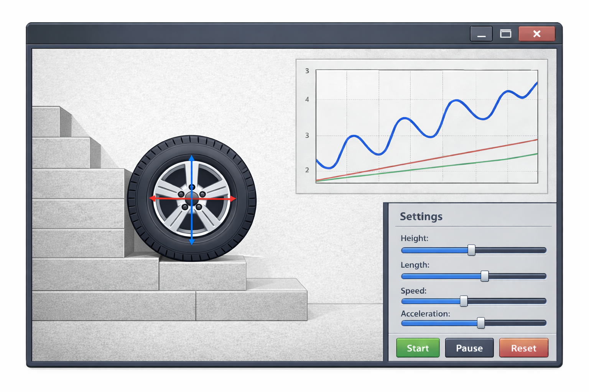

# Вариант 1 ***Wheel–Step Interaction Simulator***

3D-симулятор взаимодействия ведущего колеса с вертикальной ступенью.
Проект посвящён исследованию контактной механики, трения и вращательной динамики.  

---

## Постановка задачи

Рассматривается жёсткое колесо радиуса **R**, приводимое в движение мотором с моментом **τ**, которое пытается заехать на ступень высоты **h**.

В рамках симуляции исследуется:

- условие заезда колеса на ступень
- критический момент двигателя
- влияние коэффициента трения **μ**
- влияние радиуса и массы колеса
- энергетические затраты при подъёме

Модель включает динамику твёрдого тела, контактные силы и модель двигателя.

---

## Цели проекта

- Реализовать физически корректную 3D-модель твёрдого тела
- Смоделировать контакт колеса со ступенью
- Визуализировать силы реакции и моменты
- Сравнить численные результаты с аналитическими оценками
- Обеспечить интерактивное изменение параметров
- Реализовать экспорт данных для последующего анализа

---

## Основные возможности

- 3D-сцена: колесо, плоскость, ступень
- Настраиваемые параметры:
  - радиус колеса
  - масса
  - максимальный момент двигателя
  - ограничение мощности
  - коэффициент трения
  - высота ступени
- Управление скоростью или моментом
- Отображение контактной точки и сил
- Логирование:
  - положение
  - скорость
  - угловая скорость
  - момент
  - мощность
  - энергия

---

## Используемые библиотеки

### Графика
- **OpenGL** — рендеринг 3D-сцены
- **GLFW** — создание окна и обработка ввода
- **GLAD** — загрузка функций OpenGL
- **GLM** — линейная алгебра (векторы, матрицы, кватернионы)
- **stb_image** — загрузка текстур

### Пользовательский интерфейс
- **Dear ImGui** — панель параметров и визуализация метрик

### Физика
- **Bullet Physics** — динамика твёрдых тел, контакт, трение, шарниры

### Дополнительно
- **json** — конфигурации и пресеты

---

## Результат

Проект представляет собой инженерный симулятор, позволяющий численно исследовать условия преодоления препятствия колесом и анализировать влияние параметров на устойчивость и эффективность подъёма.
#

# Вариант 2 ***Tensor Compiler***

## Описание

Проект представляет собой реализацию тензорного компилятора для вычислительных графов нейронных сетей. Компилятор принимает модель в формате ONNX, преобразует её во внутреннее представление, выполняет промежуточные преобразования и генерирует машинный байт-код.

Архитектура построена по классической схеме:

Frontend → Middle-end → Backend

## Архитектура

### Frontend

Frontend отвечает за загрузку и разбор модели ONNX, построение собственного представления графа (Graph), проверку корректности структуры и передачу данных в промежуточное представление.

Внутренний Graph содержит:
- узлы (операции),
- значения (тензоры),
- входы и выходы модели,
- атрибуты операций.

### Middle-end

Middle-end преобразует Graph в собственный IR. IR реализован в SSA-форме (Static Single Assignment), где каждое значение присваивается ровно один раз. На этом этапе выполняются базовые оптимизации и подготовка к генерации кода.

### Backend

Backend выполняет трансляцию IR в машинный байт-код, реализует низкоуровневую генерацию инструкций и формирует исполняемое представление для целевой архитектуры.

## Используемые библиотеки

ONNX — используется для загрузки и разбора моделей нейронных сетей в формате `.onnx`.

Protobuf — используется для десериализации ONNX-файла и доступа к структурам ModelProto, GraphProto и NodeProto.

Flex — генератор лексического анализатора, применяется для токенизации входного текстового представления (при использовании собственного DSL).

Bison — генератор синтаксического анализатора, используется для построения AST или IR из текстового представления.

## Общий пайплайн

ONNX → Graph → SSA IR → Optimizations → Machine Bytecode

Проект реализует полный компиляторный конвейер для графов нейронных сетей.